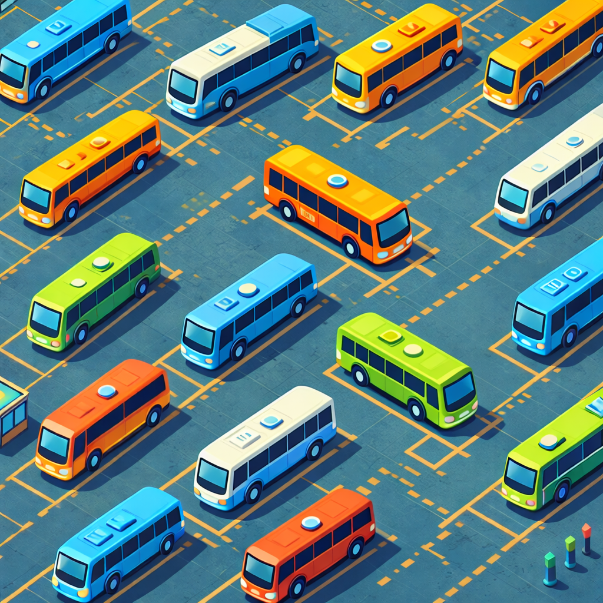

# I ❤️ Buses

## Overview

"I ❤️ Buses" is a multiplayer network game where buses controlled by computer programs compete to pick up
passengers and bring them to their destinations.

Programs are written in Python and Pygame is used to render the playing field.

This version is a rewrite based on Adrien's work on I-like-trains.
